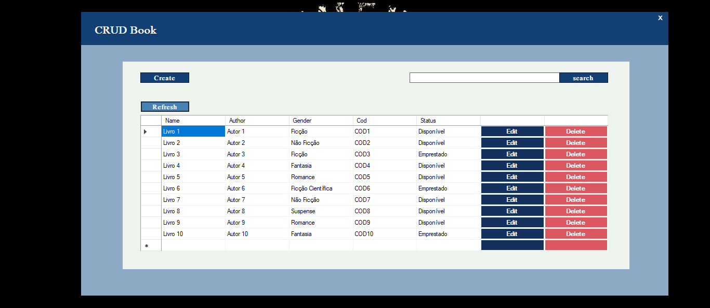
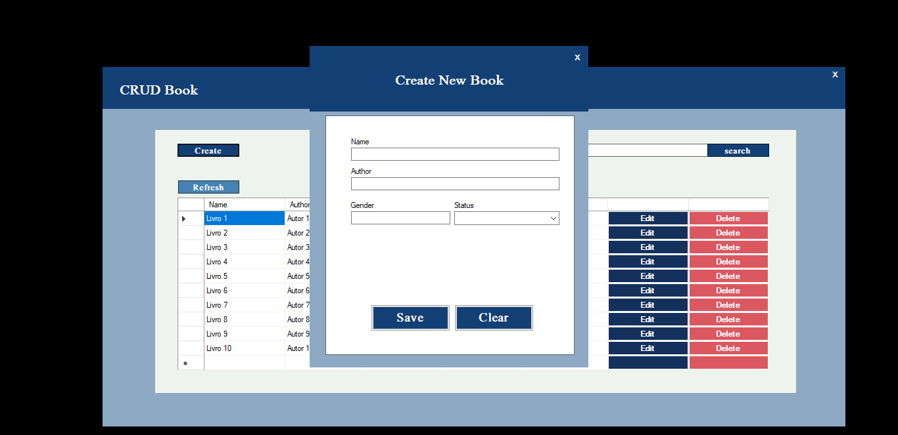
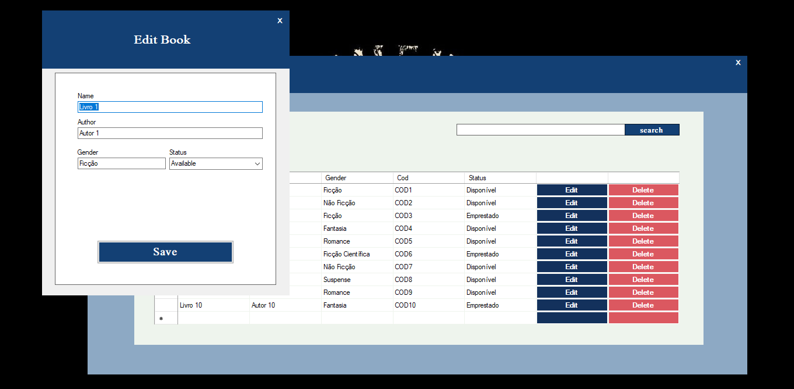

## Projeto de Prática de Comandos SQL em C# com SQLite

Este projeto foi desenvolvido com o objetivo de praticar a integração de comandos SQL dentro de aplicativos C#, além de explorar a conexão com um banco de dados SQLite. A aplicação também serve como uma oportunidade para estudar os elementos fundamentais de uma aplicação em Windows Forms.

### Recursos e Funcionalidades:
- Conexão com um banco de dados SQLite para armazenamento de dados.
- Implementação de comandos SQL para realizar operações de CRUD (Create, Read, Update, Delete) no banco de dados.
- Interface gráfica desenvolvida utilizando Windows Forms para proporcionar uma experiência amigável ao usuário.

### Imagens do Projeto:

**Imagem 1: Tela Principal**

**Imagem 2: Tela de Funcionalidade Criar e Editar**

Este projeto é ideal para aqueles que desejam aprimorar suas habilidades em C#, SQL e desenvolvimento de aplicativos Windows Forms, fornecendo uma base sólida para projetos mais complexos no futuro.

 
